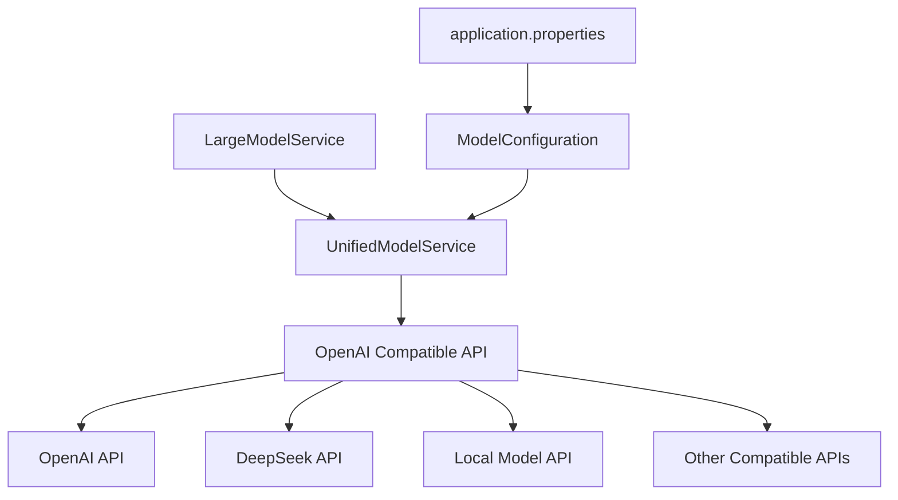

# 设计文档

## 概述

本设计将EmoCloud后端从硬编码的Vivo蓝心大模型改造为支持OpenAI兼容接口的统一AI模型架构。通过统一的OpenAI API格式，支持OpenAI、DeepSeek、本地模型等所有兼容OpenAI接口的AI提供商，实现简单的配置驱动模型切换。

## 架构

### 核心架构模式

1. **统一接口模式**：所有AI模型都通过OpenAI兼容接口调用
2. **配置驱动架构**：通过单一配置文件管理模型参数
3. **适配器模式**：将现有Vivo模型调用适配到OpenAI格式（可选保留）

### 系统架构图



## 组件和接口

### 1. 核心服务类

#### UnifiedModelService 类
```java
@Service
public class UnifiedModelService {
    private final ModelConfiguration config;
    private final RestTemplate restTemplate;
    
    /**
     * 调用AI模型进行对话（统一OpenAI格式）
     * @param prompt 用户输入
     * @param emotionTag 情绪标签
     * @return 模型响应
     */
    public String callModel(String prompt, String emotionTag);
    
    /**
     * 调用AI模型处理聊天历史
     * @param chatHistory 聊天历史
     * @return 总结内容
     */
    public String summarizeChat(List<String> chatHistory);
    
    /**
     * 调用AI模型进行场景对话
     * @param message 用户消息
     * @param sceneType 场景类型
     * @return 场景回复
     */
    public String callForVirtualScene(String message, String sceneType);
    
    /**
     * 生成场景背景
     * @param emotionTag 情绪标签
     * @return 场景背景
     */
    public String generateSceneBackground(String emotionTag);
}
```

### 2. 配置管理组件

#### ModelConfiguration 类
```java
@Configuration
@ConfigurationProperties(prefix = "ai.model")
public class ModelConfiguration {
    private String baseUrl;        // API基础URL
    private String apiKey;         // API密钥
    private String model;          // 模型名称
    private int timeout = 30000;   // 超时时间
    private int maxRetries = 3;    // 最大重试次数
    
    // getters and setters
    public boolean isValid() {
        return baseUrl != null && !baseUrl.isEmpty() 
            && apiKey != null && !apiKey.isEmpty()
            && model != null && !model.isEmpty();
    }
}
```

### 3. OpenAI兼容请求/响应模型

#### OpenAIRequest 类
```java
public class OpenAIRequest {
    private String model;
    private List<Message> messages;
    private double temperature = 0.7;
    private int max_tokens = 1000;
    
    public static class Message {
        private String role;    // "system", "user", "assistant"
        private String content;
        
        // constructors, getters, setters
    }
    
    // constructors, getters, setters
}
```

#### OpenAIResponse 类
```java
public class OpenAIResponse {
    private String id;
    private String object;
    private long created;
    private String model;
    private List<Choice> choices;
    
    public static class Choice {
        private int index;
        private Message message;
        private String finish_reason;
        
        // constructors, getters, setters
    }
    
    // constructors, getters, setters
}
```

## 数据模型

### 配置数据模型

#### application.properties 配置结构
```properties
# AI模型统一配置（OpenAI兼容格式）
ai.model.base-url=https://api.deepseek.com/v1
ai.model.api-key=${AI_API_KEY}
ai.model.model=deepseek-chat
ai.model.timeout=30000
ai.model.max-retries=3

# 示例配置说明：
# OpenAI: base-url=https://api.openai.com/v1, model=gpt-3.5-turbo
# DeepSeek: base-url=https://api.deepseek.com/v1, model=deepseek-chat  
# 本地模型: base-url=http://localhost:8000/v1, model=local-model
```

### 常量定义

#### ModelConstants 类
```java
public class ModelConstants {
    // 系统角色提示
    public static final String SYSTEM_ROLE = "system";
    public static final String USER_ROLE = "user";
    public static final String ASSISTANT_ROLE = "assistant";
    
    // 默认参数
    public static final double DEFAULT_TEMPERATURE = 0.7;
    public static final int DEFAULT_MAX_TOKENS = 1000;
    
    // 情绪标签处理模板
    public static final String EMOTION_PROMPT_TEMPLATE = 
        "用户当前情绪为%s，请以适当的语气回复：%s";
    
    // 场景对话模板
    public static final String SCENE_PROMPT_TEMPLATE = 
        "你是一个%s场景中的角色。用户说：%s";
        
    // 场景背景生成模板
    public static final String BACKGROUND_PROMPT_TEMPLATE = 
        "请为情绪为%s的用户生成一个场景背景描述，用于虚拟场景交互。";
}

## 错误处理

### 错误处理策略

1. **配置错误处理**
   - 配置参数缺失时抛出启动异常
   - 提供配置验证方法
   - 记录配置加载日志

2. **运行时错误处理**
   - API调用失败时自动重试
   - 网络超时处理
   - 记录详细错误日志

3. **自定义异常类**
```java
public class ModelServiceException extends RuntimeException {
    private final String errorCode;
    private final int httpStatus;
    
    public ModelServiceException(String message, String errorCode, int httpStatus) {
        super(message);
        this.errorCode = errorCode;
        this.httpStatus = httpStatus;
    }
    
    // getters
}

public class ModelConfigurationException extends RuntimeException {
    public ModelConfigurationException(String message) {
        super(message);
    }
}
```

### 重试机制

```java
@Component
public class ModelServiceResilience {
    private static final Logger logger = LoggerFactory.getLogger(ModelServiceResilience.class);
    
    @Retryable(value = {ModelServiceException.class}, maxAttempts = 3, backoff = @Backoff(delay = 1000))
    public String callWithRetry(OpenAIRequest request) {
        logger.info("尝试调用AI模型，重试次数: {}", getCurrentAttempt());
        // 调用逻辑
        return callModel(request);
    }
    
    @Recover
    public String fallback(ModelServiceException ex, OpenAIRequest request) {
        logger.error("AI模型调用失败，已达到最大重试次数", ex);
        return "抱歉，AI服务暂时不可用，请稍后再试。";
    }
}
```

## 测试策略

### 单元测试

1. **统一模型服务测试**
   - OpenAI API调用测试
   - 请求格式化测试
   - 响应解析测试
   - 错误处理测试

2. **配置管理测试**
   - 配置加载测试
   - 配置验证测试
   - 默认值测试

3. **工具方法测试**
   - 提示构建测试
   - 情绪标签处理测试
   - 消息格式化测试

### 集成测试

1. **端到端测试**
   - 完整对话流程测试
   - 聊天历史处理测试
   - 场景对话测试

2. **性能测试**
   - 并发调用测试
   - 响应时间测试
   - 重试机制测试

### 测试工具和Mock

```java
@TestConfiguration
public class ModelTestConfiguration {
    @Bean
    @Primary
    public RestTemplate mockRestTemplate() {
        return Mockito.mock(RestTemplate.class);
    }
    
    @Bean
    public ModelConfiguration testModelConfiguration() {
        ModelConfiguration config = new ModelConfiguration();
        config.setBaseUrl("http://test-api.com/v1");
        config.setApiKey("test-key");
        config.setModel("test-model");
        return config;
    }
}
```

## 监控和日志

### 日志记录策略

1. **结构化日志**
   - 记录API调用的关键信息
   - 包含请求ID、模型名称、响应时间等

2. **日志级别**
   - DEBUG: 详细的API调用信息和请求内容
   - INFO: 配置加载、模型调用成功
   - WARN: 重试操作、响应时间过长
   - ERROR: 调用失败、配置错误

### 监控指标

1. **业务指标**
   - 模型调用次数和频率
   - 成功率和失败率
   - 平均响应时间

2. **技术指标**
   - 重试次数统计
   - 网络超时次数
   - 配置更新记录

### 健康检查

```java
@Component
public class ModelHealthIndicator implements HealthIndicator {
    private final UnifiedModelService modelService;
    
    @Override
    public Health health() {
        try {
            // 发送简单的健康检查请求
            String response = modelService.callModel("健康检查", null);
            return Health.up()
                .withDetail("model", "available")
                .withDetail("response_time", "< 5s")
                .build();
        } catch (Exception e) {
            return Health.down()
                .withDetail("model", "unavailable")
                .withDetail("error", e.getMessage())
                .build();
        }
    }
}
```